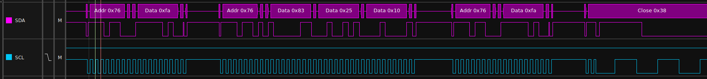

# legendary-dashboard - Developer Notes

## BME280 Environment Sensor

Things to keep in mind:

1. Despite several wiring diagrams on the web, the ESP32-Wire-Library for TTGO-T1 board uses pins 21 (SDA) and 23 (SCL) by default.

Sample logic-trace with 100kHz I²C-frequency:

