# Legendary Dashboard - Tutorial

## Open project

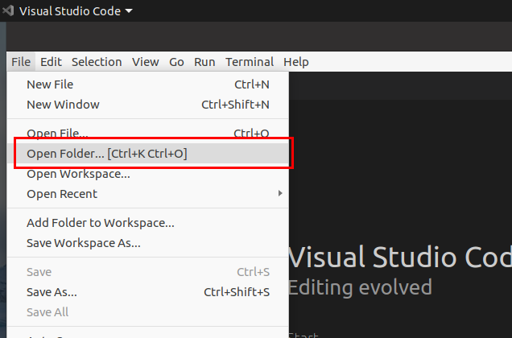

## Explorer view

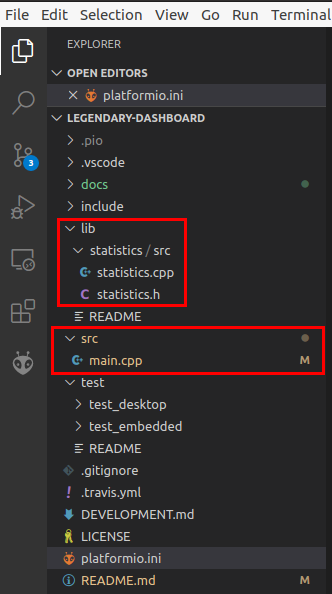

## PlatformIO Tasks

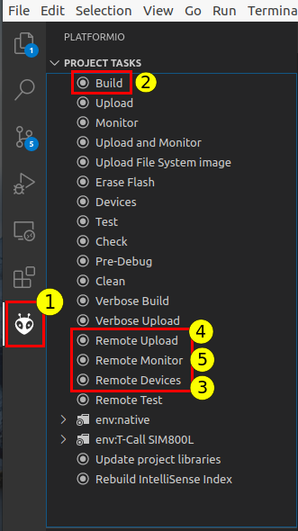

## (2) Build Project

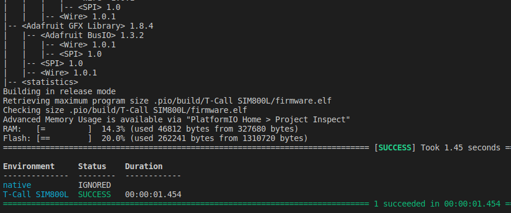

## (3) Remote Devices

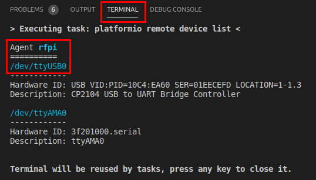

## (4) Remote Upload

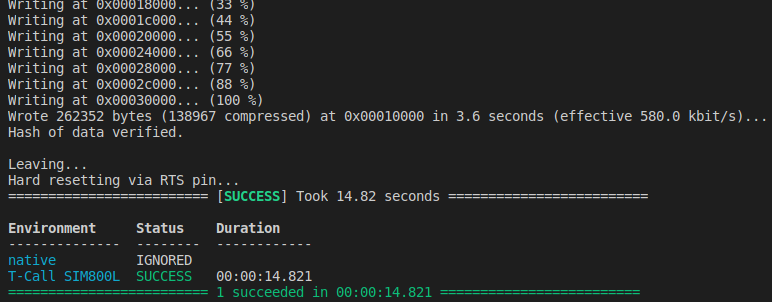

## (5) Remote Monitor

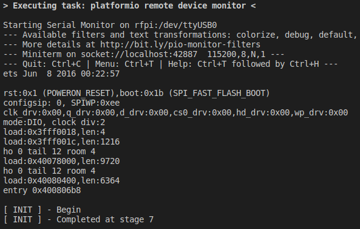

## native Unit-tests

These tests will be run locally on your PC

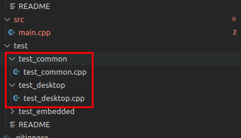

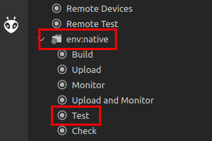

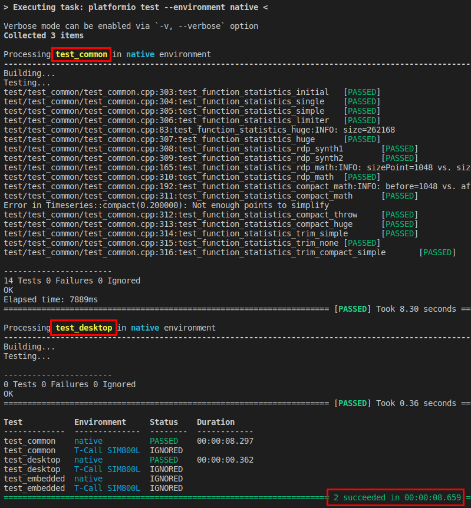

## Image conversion

This is how it works with [GIMP](https://www.gimp.org/). 

1. Create an image with the size of your display (e.g. 400x300).
2. Adjust brightness and contrast to almost extreme values.
3. Create a palette that represents the colors available on your display and convert the image:

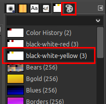

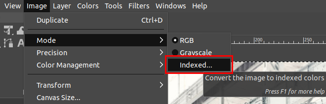

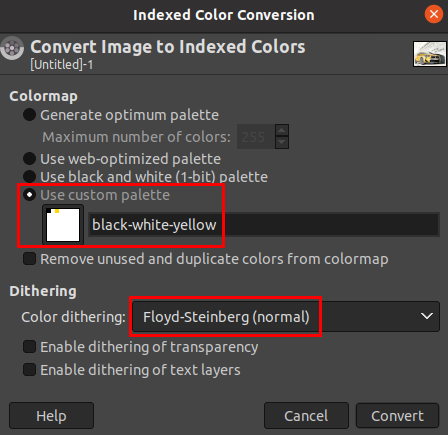

4. separate both colors (black, yellow) and save each into a separate file. Convert each file with [image2cpp](http://javl.github.io/image2cpp/) 
